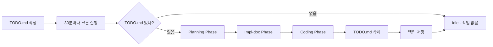

# 🎮 radar_fun_meter

**범용 게임 재미 측정 도구**
Flow Theory 기반으로 게임 밸런스를 자동 분석해줌.

[](https://www.npmjs.com/package/radar_fun_meter)
[](https://opensource.org/licenses/MIT)

## 설치

```bash
# npm 글로벌 설치
npm install -g radar_fun_meter

# 또는 로컬 프로젝트에 설치
npm install radar_fun_meter

# CLI 실행
funmeter --game=example --runs=100
```

개발 모드 (로컬 클론):
```bash
git clone https://github.com/on1659/radar_fun_meter.git
cd radar_fun_meter
node src/cli.js --game=example --runs=100
```

## 컨셉

> 재미 = 실력과 난이도의 균형 (Flow Theory)
> - 너무 쉬움 → 지루함
> - 딱 맞음 → FLOW (재밌음!)
> - 너무 어려움 → 불쾌함/포기

봇이 게임을 N번 자동 플레이 → 생존 시간/점수 분석 → Flow Zone 판정 → 파라미터 조정 제안

## 사용법

```bash
# 예제 게임 테스트 (기본: RandomBot)
node src/cli.js --game=example --runs=100

# HumanLikeBot 사용 (사람처럼 반응)
node src/cli.js --game=timing-jump --runs=100 --bot=human

# Worker 병렬 실행 (CPU 코어 수만큼)
node src/cli.js --game=timing-jump --runs=200 --parallel=4

# 실시간 대시보드 (웹 브라우저 자동 오픈)
node src/cli.js --game=timing-jump --serve --runs=100

# 파라미터 조정하면서 비교
node src/cli.js --game=timing-jump --runs=100 --config.initialSpeed=150
node src/cli.js --game=timing-jump --runs=100 --config.initialSpeed=260

# 자동 최적화 (Flow Zone 도달까지 파라미터 탐색)
node src/cli.js --game=timing-jump --optimize --opt.runs=50 --opt.iter=15 --bot=human

# 결과 파일 저장 (.json / .html / .md)
node src/cli.js --game=example --runs=100 --output=report.html

# GitHub Gist로 공유
node src/cli.js --game=example --runs=100 --share
funmeter --view=<gist-id>

# 실행 이력 보기
funmeter --history

# 모든 게임 한번에
npm run test:all
```

### 봇 타입

| 봇 | CLI 옵션 | 설명 | 용도 |
|------|------|------|------|
| `random` | `--bot=random` | 랜덤 확률로 입력 (기본) | 빠른 테스트, 극단적 난이도 체크 |
| `human` | `--bot=human` | 장애물/이벤트 감지 후 반응 (100~300ms 지연) | 실제 사람 플레이 시뮬레이션 |
| `smart` | `--bot=smart` | 장르 자동 감지 + 점수 트렌드 기반 적응형 봇 | 다양한 게임 타입 자동 지원 |
| `ml` | `--bot=ml` | Q-Learning 강화학습 봇 | 학습 기반 전략, 반복 최적화 |
| `flappy` | `--bot=flappy` | FlappyBird 전용 봇 (파이프 간격 중앙 조준) | FlappyBird 게임 전용 |

### 자동 최적화

Flow Zone에 도달할 때까지 게임 파라미터를 자동 탐색합니다 (Binary Search 기반).

```bash
# 기본 (게임별 기본 파라미터 자동 적용)
node src/cli.js --game=timing-jump --optimize

# 옵션 조절
node src/cli.js --game=stack-tower --optimize \
  --opt.runs=30 \      # 반복당 실행 횟수 (기본 50)
  --opt.iter=20 \      # 최대 반복 횟수 (기본 20)
  --bot=human          # 봇 타입 지정

# 커스텀 파라미터 탐색
node src/cli.js --game=timing-jump --optimize \
  --opt.param=speedIncrement --opt.min=0 --opt.max=0.2 --opt.direction=higher
```

지원 게임: `timing-jump`, `stack-tower`, `rhythm-tap`, `flappy-bird`, `heartbeat`

## 새 게임 추가

1. `games/{게임이름}/` 폴더 생성
2. `GameAdapter`를 상속해서 구현:

```js
const GameAdapter = require('../../src/GameAdapter');

class MyGame extends GameAdapter {
  reset() { /* 게임 초기화 */ }
  update(input) { /* 한 프레임 진행 */ }
  getScore() { return this.score; }
  isAlive() { return this.alive; }
  getDifficulty() { return /* 0~1 사이 값 */; }
  getName() { return 'MyGame'; }
}

module.exports = MyGame;
```

3. `src/cli.js`의 GAMES 레지스트리에 등록
4. 실행: `node src/cli.js --game=mygame --runs=100`

## 현재 지원 게임

| 게임 | 파일 | 설명 | 최적화 파라미터 |
|------|------|------|----------------|
| `example` | `games/example/ExampleGame.js` | 장애물 타이밍 점프 예제 | — |
| `timing-jump` | `games/timing-jump/TimingJumpAdapter.js` | 장애물 점프 | `initialSpeed` |
| `rhythm-tap` | `games/rhythm-tap/RhythmTapAdapter.js` | 리듬 탭 | `botAccuracy` |
| `stack-tower` | `games/stack-tower/StackTowerAdapter.js` | 블록 쌓기 (레벨 모드) | `botError` |
| `flappy-bird` | `games/flappy-bird/FlappyBirdAdapter.js` | 파이프 통과 | `pipeSpeed` |
| `heartbeat` | `examples/heartbeat/HeartBeatAdapter.js` | 생명력 관리 튜토리얼 | `drainRate` |

## TypeScript / ESM 사용

**CommonJS:**
```js
const { FunMeter, RandomBot, Optimizer } = require('radar_fun_meter');
```

**ESM (Node.js 16+):**
```js
import { FunMeter, RandomBot, Optimizer } from 'radar_fun_meter';
```

**TypeScript:**
```ts
import { FunMeter, FunMeterOptions, RunResult } from 'radar_fun_meter';

const meter = new FunMeter({ ticksPerSecond: 60, maxSeconds: 60 });
```

## 폴더 구조

```
radar_fun_meter/
├── src/
│   ├── GameAdapter.js      ← 게임 인터페이스 (베이스 클래스)
│   ├── FunMeter.js         ← 분석 엔진
│   ├── Optimizer.js        ← 이진 탐색 기반 파라미터 최적화
│   ├── BrowserGameAdapter.js ← Playwright 웹게임 어댑터
│   ├── cli.js              ← CLI 진입점
│   ├── index.js            ← CJS 공개 API
│   ├── index.d.ts          ← TypeScript 타입 선언
│   ├── bots/
│   │   ├── RandomBot.js
│   │   ├── HumanLikeBot.js
│   │   ├── SmartBot.js
│   │   ├── MLBot.js
│   │   ├── FlappyBirdBot.js
│   │   └── BrowserBot.js
│   ├── esm/
│   │   ├── index.js        ← ESM 래퍼
│   │   └── index.d.ts      ← ESM 타입 선언
│   ├── server/
│   │   └── index.js        ← 대시보드 서버 (--serve)
│   ├── reporters/
│   │   ├── htmlReporter.js
│   │   ├── mdReporter.js
│   │   └── gistReporter.js ← GitHub Gist 공유 (--share/--view)
│   └── worker/
│       └── runnerWorker.js ← Worker threads 병렬 실행 (--parallel)
├── games/
│   ├── example/
│   ├── timing-jump/
│   ├── rhythm-tap/
│   ├── stack-tower/
│   └── flappy-bird/
├── examples/
│   └── heartbeat/
└── README.md
```

## CLI 전체 옵션

```bash
funmeter --game=<이름> [옵션]

기본 옵션:
  --game=<이름>           게임 선택 (기본: example)
  --runs=<n>              실행 횟수 (기본: 100)
  --bot=random|human|smart|ml|flappy  봇 종류 (기본: random)
  --parallel=<n>          Worker 수 (기본: 1, random/human/flappy 봇 지원)
  --output=<파일>         결과를 파일로 저장 (.json / .html / .md)
  --list-games            사용 가능한 게임 목록 출력

서버 옵션:
  --serve                 로컬 대시보드 서버 기동
  --port=<n>              서버 포트 (기본: 4567, 범위: 1024~65535)
  --history               저장된 실행 이력 출력 후 종료

공유 옵션:
  --share                 결과를 GitHub Gist로 업로드
  --view=<gist-id>        저장된 Gist 결과 터미널 출력

최적화 옵션:
  --optimize              최적화 모드 활성화
  --opt.runs=<n>          반복당 실행 횟수 (기본: 50, 최대: 10000)
  --opt.iter=<n>          최대 탐색 횟수 (기본: 20, 최대: 100)
  --opt.param=<이름>      커스텀 탐색 파라미터 이름
  --opt.min=<값>          탐색 최솟값
  --opt.max=<값>          탐색 최댓값
  --opt.direction=higher|lower  어려워지는 방향
```

## 결과 예시

```
📊 결과: ExampleGame (100회)
──────────────────────────────────────────────────
생존 시간
  평균:   18.3s  (σ=8.2s)
  중앙값: 16.1s
  범위:   2.4s ~ 60.0s
  p25/p75/p90: 11.2s / 24.3s / 35.1s

타임아웃: 3%
──────────────────────────────────────────────────

✅ FLOW Zone! (재밌을 가능성 높음)
💡 균형 잘 잡혔어. 난이도 상승 곡선 유지하면 됨.
```
## 🤖 Auto Dev PD v2 - TODO 기반 자동 개발

이 프로젝트는 **Auto Dev PD v2** 스킬로 자동 개발되고 있습니다.

### 사용법

1. **새 기능 추가하고 싶을 때:**
   - 프로젝트 루트에 `TODO.md` 파일 생성
   - 원하는 기능/수정사항을 자연어로 작성

2. **자동 개발 시작:**
   - 30분마다 자동 실행 (크론)
   - TODO.md → Planning → Impl-doc → Coding 자동 진행
   - 완료 시 TODO.md 자동 삭제

3. **진행 상황 확인:**
   - `.dev/state.json` - 현재 단계 추적
   - `.dev/history/` - 과거 계획/구현 문서 백업
   - `PLAN.md` / `IMPL.md` - 임시 작업 문서 (완료 시 삭제됨)

### TODO.md 예시

```markdown
# TODO

## CLI 개선
- `--help` 옵션 추가
- `--output` JSON 포맷 지원
- `--list-games` 게임 목록 출력

## 테스트 강화
- 단위 테스트 추가 (Jest)
- CI/CD 파이프라인 구성

## 문서화
- API 레퍼런스 생성
- 예제 추가
```

### 작동 방식



**장점:**
- ✅ 자동화와 제어의 균형 (TODO 없으면 안 돌음)
- ✅ 토큰 낭비 방지 (작업 있을 때만 실행)
- ✅ 히스토리 추적 (.dev/history/)
- ✅ 다른 프로젝트에도 적용 가능

**팁:**
- TODO.md는 간결하게 (2~5개 항목)
- 우선순위 명시하면 Planning 단계에서 반영됨
- 긴급 작업은 TODO.md 대신 직접 수정 권장
